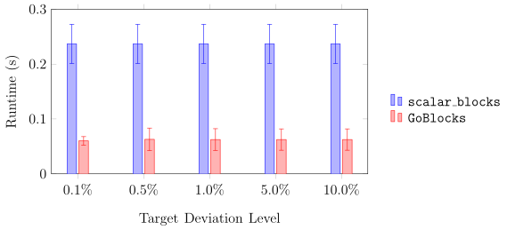
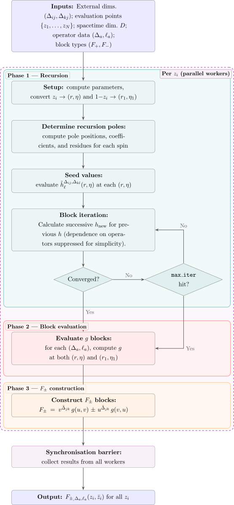
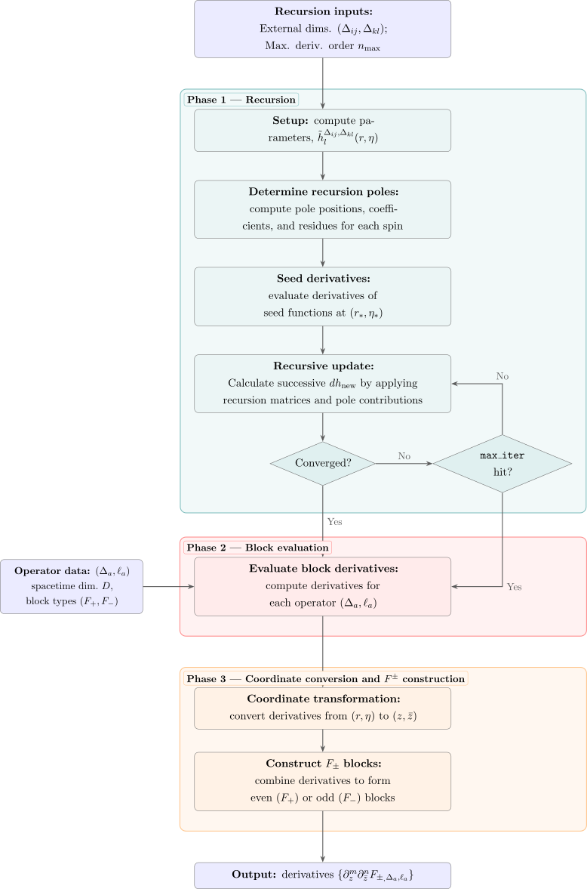

**GoBlocks** is a fast conformal block generator designed for numerical conformal bootstrap calculations. Written in the Go programming language, it evaluates conformal blocks efficiently using recursive relations and parallel computation. This allows blocks to be generated on demand, which is particularly useful in primal bootstrap studies where conformal blocks must be recomputed repeatedly during optimisation.

GoBlocks supports both **multi-point** and **derivative-based** bootstrap approaches. The multi-point method evaluates the crossing equations at selected points in the conformal cross-ratio plane, while the derivative approach computes derivatives at the crossing-symmetric point. The implementation prioritises computational speed and flexibility, making it well suited to exploratory scans and truncation-based bootstrap methods where operator dimensions and OPE coefficients vary dynamically.

<!--  -->

Compared with **scalar_blocks**, the widely used high-precision conformal block package, GoBlocks emphasises rapid evaluation rather than extremely high numerical precision. While scalar_blocks is optimised for semidefinite-programming bootstrap methods requiring very high accuracy, GoBlocks can generate blocks significantly faster with sub-percent accuracy across typical parameter ranges. This makes it particularly useful for large parameter scans and exploratory bootstrap searches.

---

## Algorithm

The implementation in GoBlocks follow the recursive algorithm presented in [1406.4858](https://arxiv.org/abs/1406.4858). A schematic for the multi-point method is presented below:

<!--  -->

Likewise, for the crossing symmetric point (CSP) derivative method:
<!--  -->

---

## Installation

Installation instructions can be found on the 
[GoBlocks GitHub repository](https://github.com/xand-stapleton/goblocks).
